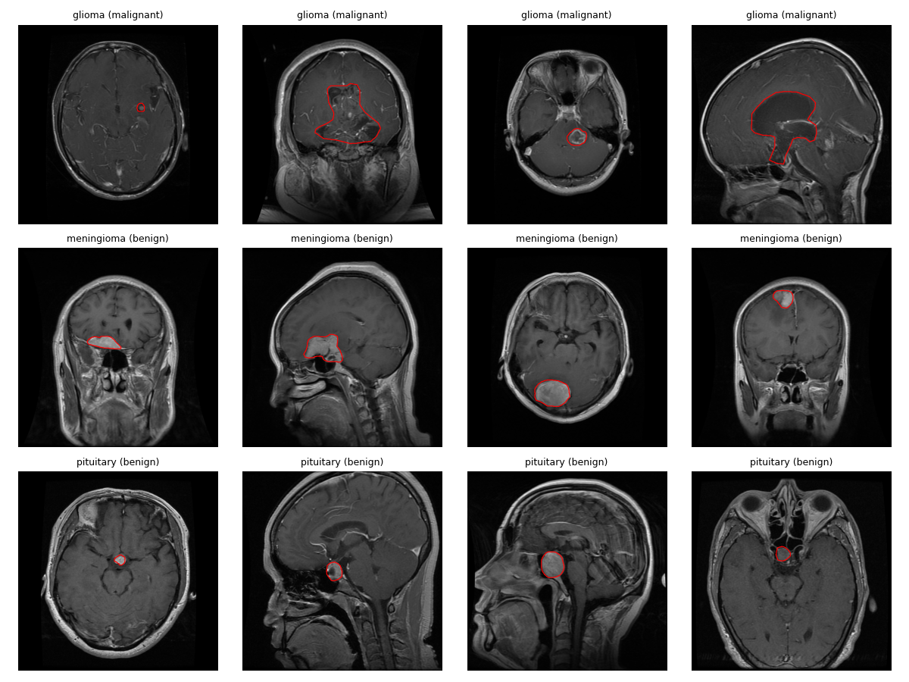
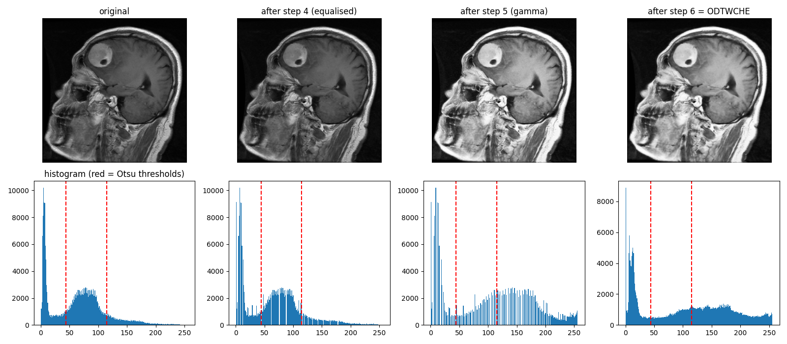
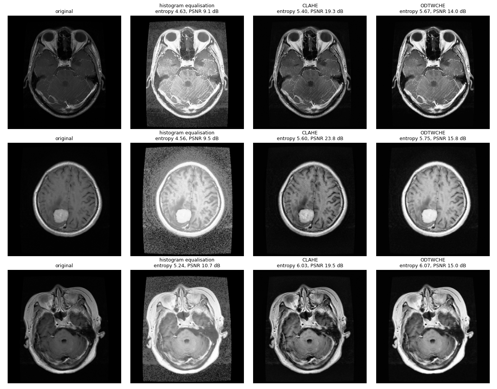
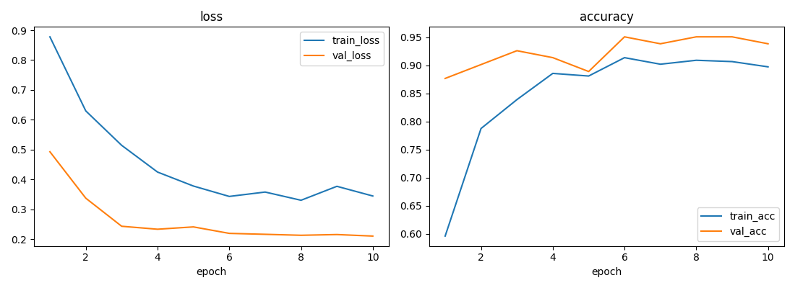
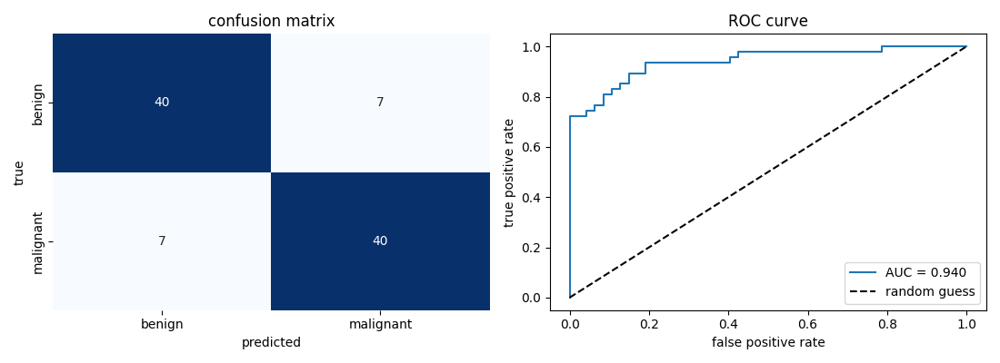
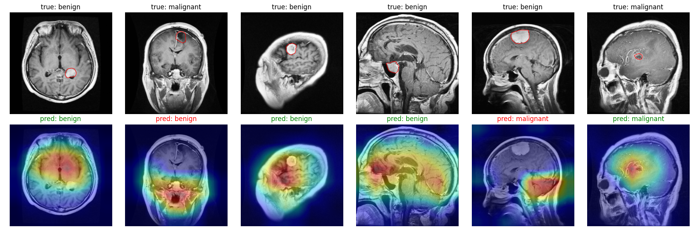

# 🧠 Brain Tumor Classification from MRI
### Contrast enhancement (ODTWCHE) + Transfer learning (Inception V3) + Explainability (Grad-CAM)


The system classifies brain tumours in MRI scans as **benign** or **malignant** in two phases.
First it improves low-contrast MRI images with the **ODTWCHE** enhancement technique.
Then it classifies them with a pre-trained **Inception V3** network.
I also added **Grad-CAM** heat-maps to show *where* the model looks, and I train on a CPU with a **patient-level** data split.

```
 MRI slice ──► ODTWCHE contrast enhancement ──► Inception V3 (transfer learning) ──► benign / malignant
                                                              │
                                                              └──► Grad-CAM heat-map (explainability)
```

---

## 📌 Highlights
- **ODTWCHE implemented from scratch.** The authors published no code, so the 6-step method was rebuilt from the paper:
  Otsu double threshold → weighted constrained histogram → PSO optimisation → sub-histogram equalisation → adaptive gamma correction → Wiener filter
- **Transfer learning** with ImageNet-pretrained Inception V3, trained on a laptop CPU in about 30 minutes
- **Patient-level train / val / test split.** No patient appears in more than one split, so the test score reflects unseen patients
- **Medical evaluation metrics:** sensitivity per class, confusion matrix, ROC / AUC
- **Grad-CAM explainability**, compared against the tumour outlines drawn by radiologists
- **Readable notebooks:** the training and evaluation code is written out step by step, with explanations

---

## 📂 Dataset
[Figshare brain tumor dataset](https://figshare.com/articles/dataset/brain_tumor_dataset/1512427) (Cheng et al., 2017), the same dataset used in the paper.

| | |
|---|---|
| Images | 3064 T1-weighted contrast-enhanced MRI slices (axial, coronal, sagittal) |
| Patients | 233 |
| Tumour types | meningioma (708), glioma (1426), pituitary (930) |
| Extra | tumour mask for every image, drawn by radiologists |

Following the paper, the tumours are grouped into two classes: **benign** (meningioma, pituitary) and **malignant** (glioma).
To train on a CPU, a balanced subset is used: **603 images from 128 patients** (at most 5 slices per patient), split 70 / 15 / 15 **by patient**.

| split | benign | malignant | patients |
|---|---|---|---|
| train | 215 | 213 | 89 |
| validation | 39 | 42 | 19 |
| test | 47 | 47 | 20 |

> The dataset is **not** included in this repository. Notebook 01 downloads it automatically (~880 MB).



---

## ⚙️ Method

### Phase 1: ODTWCHE contrast enhancement
| step | what it does |
|---|---|
| 1. Otsu double threshold | splits the histogram into 3 parts: background, brain tissue, bright regions |
| 2. Weighted constraint | reduces the influence of very frequent grey levels (prevents over-enhancement) |
| 3. Particle Swarm Optimisation | searches for the weights that give the highest entropy (most detail) |
| 4. Histogram equalisation | equalises each part separately, inside its own grey-level range |
| 5. Adaptive gamma correction | improves global contrast, brightens dark regions |
| 6. Wiener filter | removes noise |



Compared with standard methods, ODTWCHE gives the highest entropy (most detail).
It also avoids the background noise that plain histogram equalisation creates:



### Phase 2: Inception V3 transfer learning
- ImageNet-pretrained Inception V3, input size 299 × 299
- all layers frozen except the last two Inception blocks (`Mixed_7b`, `Mixed_7c`)
- new output layer: dropout 0.2 → fully connected layer (2 classes)
- augmentation: rotation by 90 / 180 / 270° and horizontal / vertical flips

| setting | value | paper |
|---|---|---|
| optimiser | SGD, momentum 0.9 | same |
| L2 regularisation | 0.0001 | same |
| learning rate | 0.001, × 0.1 every 4 epochs | × 0.1 every 10 epochs |
| epochs | 10 | 30 |
| batch size | 16 | not reported |



---

## 📊 Results
Test set: **94 images from 20 patients** the model never saw during training.

| metric | this project | paper |
|---|---|---|
| Accuracy | **85.1 %** | 98.89 % |
| Sensitivity (benign) | 85.1 % | 96.89 % |
| Sensitivity (malignant) | 85.1 % | 97.45 % |
| F1 score | 0.851 | – |
| ROC AUC | **0.940** | – |



### Grad-CAM: where does the model look?
Top row: MRI with the radiologist's tumour outline (red). Bottom row: Grad-CAM heat-map (green = correct prediction, red = wrong).



### Observations
- **Why accuracy is lower than the paper:** this project uses 20 % of the data, a CPU, partial fine-tuning and 10 epochs.
  The test set is also split by patient, which is stricter and closer to real use.
- **Validation vs test:** validation accuracy reached 95 %, test accuracy 85 %.
  With only about 20 patients per split, results vary a lot from patient to patient.
- **Shortcut learning:** Grad-CAM shows that the model sometimes looks at the tumour's *typical location*
  (for example the skull base, where pituitary tumours sit) instead of the tumour itself.
  This shows why explainability matters in medical AI.
- **ODTWCHE:** it gives the highest entropy of the three methods, but a lower PSNR (~15 dB) than the paper reports (29 dB).
  My re-implementation enhances more strongly than the original.

---

## 🗂️ Project structure
```
brain_tumer_detection/
├── notebooks/
│   ├── 01_data_preparation.ipynb   download, convert .mat → PNG, explore, patient-level split
│   ├── 02_preprocessing.ipynb      ODTWCHE step by step, comparison with HE / CLAHE
│   ├── 03_model_training.ipynb     Inception V3 transfer learning (all code in the notebook)
│   └── 04_evaluation.ipynb         metrics, confusion matrix, ROC, Grad-CAM (all code in the notebook)
├── src/
│   ├── config.py                   paths and settings
│   ├── data_utils.py               download, .mat → PNG, patient-level split
│   └── odtwche.py                  ODTWCHE contrast enhancement
├── results/                        figures and metrics
├── data/                           created by notebook 01 (not in the repo)
├── models/                         trained model (not in the repo)
├── requirements.txt
└── README.md
```

---

## 🚀 How to run
```bash
git clone https://github.com/<your-username>/brain_tumer_detection.git
cd brain_tumer_detection
pip install -r requirements.txt
jupyter notebook notebooks/
```
Run the notebooks in order **01 → 04**:

| notebook | time on a laptop CPU |
|---|---|
| 01 data preparation | ~15–25 min (mostly the 880 MB download) |
| 02 preprocessing | ~3 min |
| 03 model training | ~30 min |
| 04 evaluation | ~1 min |

To train on more data, change `IMAGES_PER_CLASS` in `src/config.py` and `EPOCHS` in notebook 03.

---

## 🔭 Future work
- train on the full dataset with all layers unfrozen on a GPU (as in the paper)
- 3-class classification (meningioma / glioma / pituitary) instead of benign / malignant
- 5-fold cross-validation by patient for more reliable results
- crop to the brain region or use the tumour masks during training to reduce shortcut learning
- tumour segmentation (e.g. U-Net) using the radiologists' masks

---

## 📚 What I learned
- how MRI data is stored (MATLAB v7.3 / HDF5), T1 contrast-enhanced imaging, axial / coronal / sagittal views
- classic image processing: histograms, Otsu thresholding, histogram equalisation, gamma correction, Wiener filtering
- optimisation with Particle Swarm Optimisation
- transfer learning, data augmentation and fine-tuning in PyTorch
- why **patient-level splits** matter (data leakage between near-identical slices)
- medical evaluation metrics (sensitivity, ROC/AUC) and **explainability** with Grad-CAM

---

## 📖 References
1. M. Agarwal et al., "Deep learning for enhanced brain tumor detection and classification", *Results in Engineering* 22 (2024) 102117.
2. J. Cheng, "Brain tumor dataset", Figshare (2017). https://doi.org/10.6084/m9.figshare.1512427
3. J. Cheng et al., "Enhanced performance of brain tumor classification via tumor region augmentation and partition", *PLoS ONE* 10(10) (2015).
4. C. Szegedy et al., "Rethinking the Inception Architecture for Computer Vision", CVPR 2016.
5. R. R. Selvaraju et al., "Grad-CAM: Visual Explanations from Deep Networks via Gradient-based Localization", ICCV 2017.

---

> ⚠️ **Disclaimer:** this is a learning project. It is **not** a medical device and must not be used for diagnosis.
